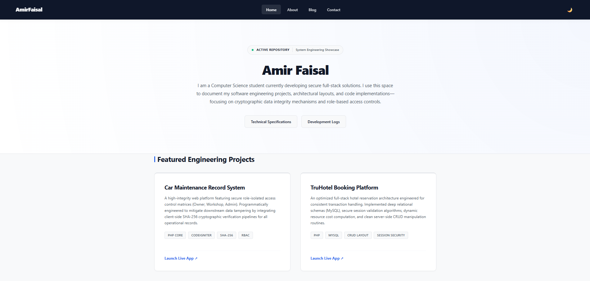
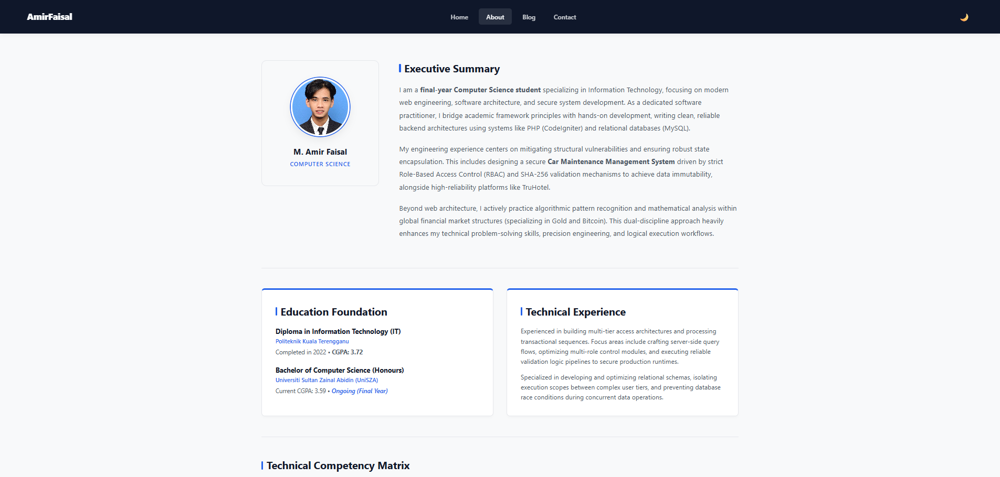
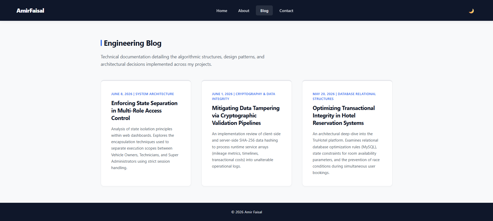
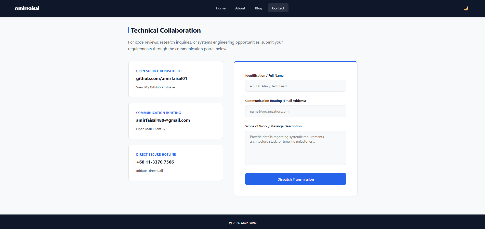

## 📑 Table of Contents
- [1. Project Description](#-1-project-description)
- [2. System Core Features](#-2-system-core-features)
- [3. Architectural Stack & Technologies](#-3-architectural-stack--technologies)
- [4. Runtime Theme Engine Logic Flow](#-4-runtime-theme-engine-logic-flow)
- [5. Structural Page Matrix & Layouts](#-5-structural-page-matrix--layouts)
- [6. Screenshots & Visual Artifacts](#-6-screenshots--visual-artifacts)
- [7. Local Installation & Deployment Guide](#-7-local-installation--deployment-guide)
- [8. Production & Verification Nodes](#-8-production--verification-nodes)

---

## 📝 1. Project Description
This repository serves as a centralized technical ledger and professional showcase for **Muhammad Amir Faisal**. The application bridges academic computer science principles with enterprise-level development practices. 

Instead of relying on heavy third-party UI framework overheads, the entire application runtime runs on native, optimized client-side structures. This ensures lightning-fast Document Object Model (DOM) rendering paint-times, zero dependencies, full semantic parsing accessibility, and cross-browser responsiveness.

---

## ✨ 2. System Core Features

- **Bi-Directional State Persistent Theme Engine:** A native JavaScript mechanism that monitors, applies, and persists user aesthetic preferences (`Light Mode` vs `Dark Mode`). It communicates seamlessly with the system browser preferences via `window.matchMedia`.
- **Fluid Grid Media Matrices:** Device-agnostic presentation layers styled strictly using modern CSS Flexbox and Grid layouts. The system guarantees absolute breakpoint stability from a minimal 320px screen width up to ultra-widescreen displays.
- **Asynchronous Form Routing Interface:** A secure client-side communication panel mapped with native dynamic browser field autocompletion, operational validations, and responsive feedback indicators.
- **Comprehensive Technical Blog Engines:** Structured technical logs showcasing architectural documentation for specialized systems such as *Car Maintenance Management Platforms* and *Relational Hotel Database Systems*.

---

## 🛠️ 3. Architectural Stack & Technologies

### Frontend Client Layer
- **HTML5 (Semantic Core Standards):** Constructed with modern structural elements (`<nav>`, `<main>`, `<section>`, `<article>`, `<footer>`) ensuring clean markup, maximum search engine optimization (SEO), and screen-reader indexing compatibility.
- **CSS3 Design Tokens:** Governed by modular system-wide variables (`:root` and `[data-theme="dark"]`) that isolate style variables such as color values, border parameters, and layout heights into an un-duplicated compilation layer.
- **JavaScript (ES6 State Control):** A localized, performance-optimized execution wrapper (`script.js`) that safely manages UI manipulation, local token storage arrays (`localStorage`), and access actions without polluting the global window scope.

### Core Architecture Reference (Featured Backends)
- **PHP Stack Architecture (CodeIgniter):** Powering featured Model-View-Controller (MVC) logic, multi-tier user dashboards, and role authentication layers.
- **MySQL Relational Engines:** Handled via clean schema isolation patterns, explicit index definitions, and integrity constraints to prevent query race conditions.
- **Cryptographic Hashing Arrays:** Integrating client and server-side SHA-256 validation pipelines to guarantee data immutability within operational logs.

---

## ⚙️ 4. Runtime Theme Engine Logic Flow

The ASCII layout below visualizes how the system's dynamic state machine initializes and shifts the theme variables across the DOM upon runtime loading:

<pre><code>
[User Initialization / Document Load]
                  │
                  ▼
      ┌───────────────────────┐
      │  Evaluate local Node  │ <─── Checks localStorage for 'portfolio-theme'
      └───────────────────────┘
                  │
          ┌───────┴───────┐
          ▼               ▼
   [Token Exists]   [No Token Found]
          │               │
          │               ▼
          │     ┌───────────────────┐
          │     │ MatchMedia Engine │ <─── Evaluates client prefers-color-scheme
          │     └───────────────────┘
          │               │
          └───────┬───────┘
                  │
                  ▼
      ┌───────────────────────┐
      │   ApplyTheme State    │ <─── Mutates [data-theme] root DOM node
      └───────────────────────┘
                  │
                  ▼
      ┌───────────────────────┐
      │   UI Repaint Event    │ <─── Tokens adjust instantly (0.3s ease transition)
      └───────────────────────┘
</code></pre>

---

## 📂 5. Structural Page Matrix & Layouts

The application repository consists of four highly focused, responsive functional modules:
1. **`index.html` (Main Core Hub):** Presents the technical introduction profile, role-based project badges, and descriptive development logs for featured live apps.
2. **`about.html` (Competency Matrix):** Focuses on the educational timeline foundations (UniSZA & Politeknik) alongside a categorized matrix block defining system specialties.
3. **`blog.html` (Engineering Logs):** Holds system case studies detailing cryptographic validation techniques, database schema optimizations, and structural multi-role access layers.
4. **`contact.html` (Transmission Portal):** Features an advanced communication frame styled for clean, validated query dispatching.

---

## 📸 6. Screenshots & Visual Artifacts

### 1. Main Dashboard Hub (`index.html`)
*The frontend interface showcasing high-impact project badges, tech stack pills, and dynamic project card layouts.*


### 2. Technical Profile Matrix (`about.html`)
*A detailed view showcasing academic qualification paths, chronological timelines, and structural competency boxes.*


### 3. Engineering Logs (`blog.html`)
*A structured technical log documenting database optimizations, role-based controls, and cryptographic verification workflows.*


### 4. Transmission Portal (`contact.html`)
*The communication panel designed with active validation, responsive input states, and data routing descriptors.*


---

## 🏃 7. Local Installation & Deployment Guide

Follow these sequential steps to mount and verify the portfolio code environment locally on your development workstation:

### 📋 Prerequisites
No external build tools, compiler managers, or package managers (`npm` / `yarn`) are required. The system runs natively on any modern browser engine (V8, Gecko, or WebKit).

### ⚙️ Initialization Setup

1. **Clone or Extract the Source Node:**
   Open your preferred terminal window and execute the following sequence:
```bash
git clone [https://github.com/your-username/portfolio-repository.git](https://github.com/your-username/portfolio-repository.git)
cd portfolio-repository
